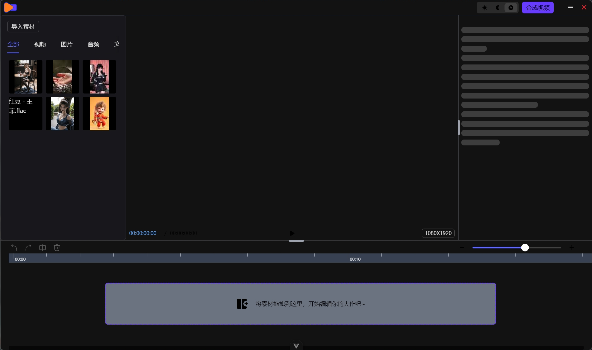

<div align="center">
	
  <h1 style="margin-top: -10px">一个兼容web端的视频剪辑工具</h1>
  <h3 style="margin-top: -20px">Tauri + Vue + TypeScript + Naive UI</h3>

  
  <br />
</div>

    WebAV: https://github.com/bilibili/WebAV
    wavesurfer.js 交互式声纹模型
    opfs-tools web 文件管理插件
    vue3-moveable 画布编写拖拽插件

---

# 项目部署指南

本指南将帮助你部署 `video-editing-web` 项目。

## 前提条件

在开始部署之前，请确保你已经安装了以下工具：

- [Node.js](https://nodejs.org/) (推荐使用最新 LTS 版本)
- [pnpm](https://pnpm.io/) (包管理器)
- [Tauri CLI](https://tauri.app/) (用于构建桌面应用)

## 安装依赖

首先，克隆项目仓库并安装依赖：

```bash
git clone https://github.com/Tenney95/video-editing-web.git
cd video-editing-web
pnpm install

pnpm dev
pnpm build

pnpm dev:tauri
pnpm build:tauri
```

---

## 计划更新内容

1、添加透明度调整、旋转角度、对齐方式

2、添加过渡动画

3、优化 ui

4、文件管理根据环境加入 tauri 方法，同时兼容 web

---

> ### 原项目： https://github.com/x007xyz/fly-cut.git
